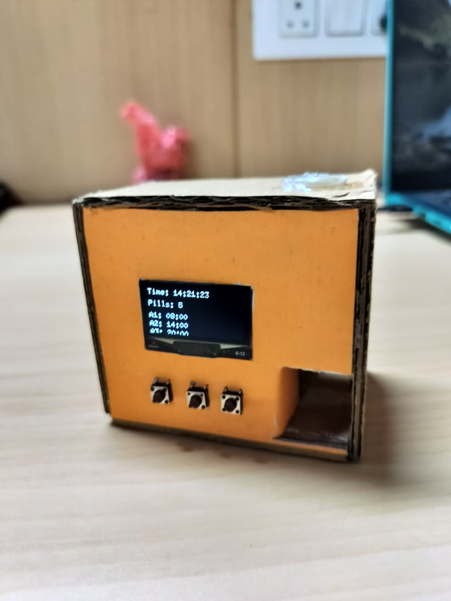
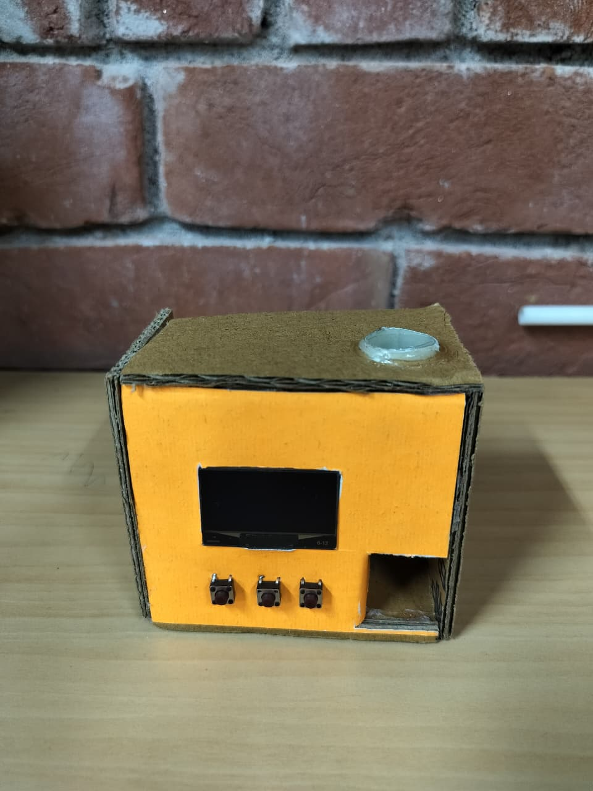
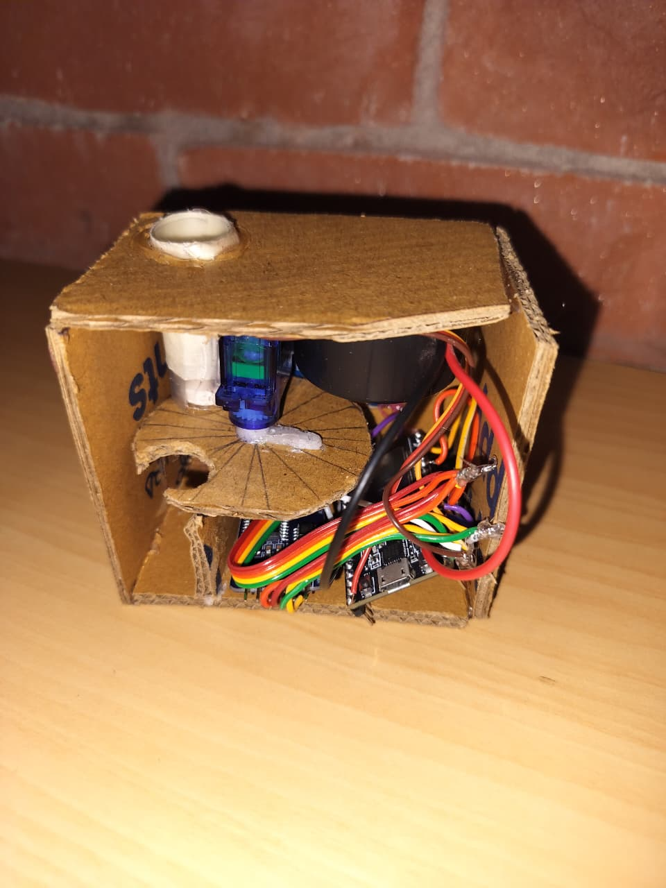
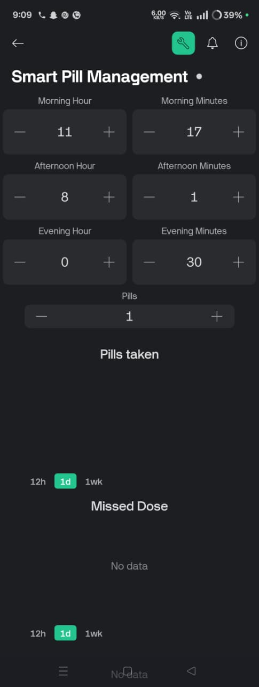

# Smart-Pill-Manager-IoT
Smart Pill Manager IoT is an ESP32-based healthcare device that automates medicine reminders and dispensing. It uses RTC for precise scheduling, servo motor for pill delivery, OLED for display, and Blynk app for remote monitoring, alerts, and missed dose tracking, ensuring better patient medication adherence.
# 💊 Smart Pill Manager IoT

An IoT-based healthcare device built using ESP32 that automates medicine reminders and pill dispensing. The system ensures timely medication intake through alarms, real-time alerts, and remote monitoring using the Blynk mobile application.

---

## 🚀 Features

- ⏰ Real-time pill reminders using RTC (DS3231)
- 💊 Automatic pill dispensing using servo motor
- 📱 Remote monitoring & control via Blynk app
- 🔔 Buzzer + visual alerts for reminders
- ⚠️ Missed dose detection with notifications
- 📊 Live pill count tracking
- 🖥️ OLED display for real-time status
- 🔘 Multi-mode button control (Fill Mode, Alarm Setting)
- 🌐 WiFi-enabled IoT system (ESP32)

---

## 🛠️ Hardware Components

- ESP32 Microcontroller  
- RTC Module (DS3231)  
- Servo Motor  
- OLED Display (SH1106)  
- Buzzer  
- DC Motor / Vibration Motor  
- Push Buttons  
- Power Supply  

---

## 💻 Software & Technologies

- Embedded C / Arduino IDE  
- ESP32 WiFi  
- Blynk IoT Platform  
- RTC Library (RTClib)  
- U8g2 Graphics Library  

---

## 📸 Project Preview

### 🛠️ Device

### ⚙️ Working

### 📱 Mobile App Interface

---

## ⚙️ How It Works

1. User sets alarm timings via buttons or Blynk app  
2. RTC keeps track of real-time  
3. At alarm time:
   - Buzzer + motor alerts user  
   - OLED displays reminder  
   - Notification sent via Blynk  
4. User presses button → Servo dispenses pill  
5. If no response within time → system marks **Missed Dose**  
6. Data is updated on mobile app  

---

## 📱 Blynk Integration

- Set alarm timings remotely  
- Update pill count  
- Receive notifications:
  - Pill Reminder  
  - Missed Dose Alert  
  - Pill Taken Confirmation  

---

---

## ⚠️ Note

> Circuit diagram is not publicly shared to maintain project originality. The working system and implementation are demonstrated through images and code.

---

## 🔮 Future Improvements

- Mobile app (custom UI instead of Blynk)  
- Voice assistant integration  
- AI-based medicine schedule prediction  
- Cloud database for patient history  
- Multiple user profiles  

---

## 👨‍💻 Author

**Vaibhav Sharma**  
IoT Developer | ESP32 | Embedded Systems | Automation  

---

## ⭐ Show Your Support

If you like this project, give it a ⭐ on GitHub!

